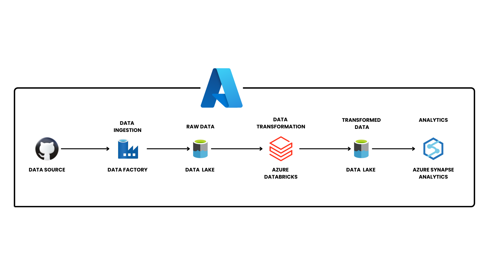

## Tokyo Olympic Data - End-to-End Data Engineering Project on Azure

## Project Overview
**This project demonstrates an end-to-end data engineering pipeline built on Microsoft Azure, leveraging various cloud services to ingest, transform, and analyze Tokyo Olympic Data. The workflow is designed for scalable, efficient, and insightful data processing.**
## Project Workflow


### Data Flow
1. **Data Source**: Tokyo Olympic dataset stored in a GitHub repository.
2. **Data Ingestion**: Data is ingested into Azure using **Azure Data Factory**.
3. **Raw Data Storage**: Data is stored in **Azure Data Lake**.
4. **Data Transformation**: Data is processed and transformed using **Azure Databricks**.
5. **Transformed Data Storage**: Processed data is stored back into **Azure Data Lake**.
6. **Analytics & Visualization**: Data is analyzed using **Azure Synapse Analytics**.

---

## 🚀 Tech Stack
- **Azure Data Factory** → Data Ingestion
- **Azure Data Lake** → Storage
- **Azure Databricks** → Data Processing & Transformation
- **Azure Synapse Analytics** → Data Analytics & Visualization
- **GitHub** → Data Source Repository

---

## 📂 Dataset

 - **The dataset used in this project contains information on the Tokyo Olympic Games, including details on athletes, events, medals, and countries.**
---

## 🔧 Setup & Deployment
### 1️⃣ Prerequisites
- Microsoft Azure account
- Access to Azure services (Data Factory, Data Lake, Databricks, Synapse Analytics)
- GitHub repository containing the dataset

### 2️⃣ Steps to Deploy
#### Step 1: Clone the repository
```sh
 git clone https://github.com/your-username/your-repository.git
 cd your-repository
```
#### Step 2: Configure Azure Data Factory
- Set up **Azure Data Factory** and create a pipeline to pull data from GitHub.
- Screenshot: .png)

#### Step 3: Store raw data in Azure Data Lake
- Configure **Azure Data Lake** as storage for ingested data.
- Screenshot: .png)

#### Step 4: Process & Clean Data with Azure Databricks
- Use **Databricks notebooks** for data transformation.
- Screenshot: .png)

#### Step 5: Store transformed data back in Azure Data Lake
- Save the cleaned data into the lake for further processing.
- Screenshot: .png)

#### Step 6: Load processed data into Azure Synapse Analytics
- Analyze and visualize data using **Azure Synapse Analytics**.
- - Screenshot: .png)
---

## 📊 Insights & Analysis
- Medal tally by country & athlete performance analysis
- Event-wise performance breakdown
- Country-wise participation trends
- Athlete demographics analysis

---

## 🎯 Key Learnings
- Setting up a scalable data pipeline using **Azure Data Engineering** services
- Efficient data ingestion, transformation, and analytics workflows
- Integrating multiple Azure services for end-to-end data processing

---

### ⭐ If you find this project helpful, please give it a star!

